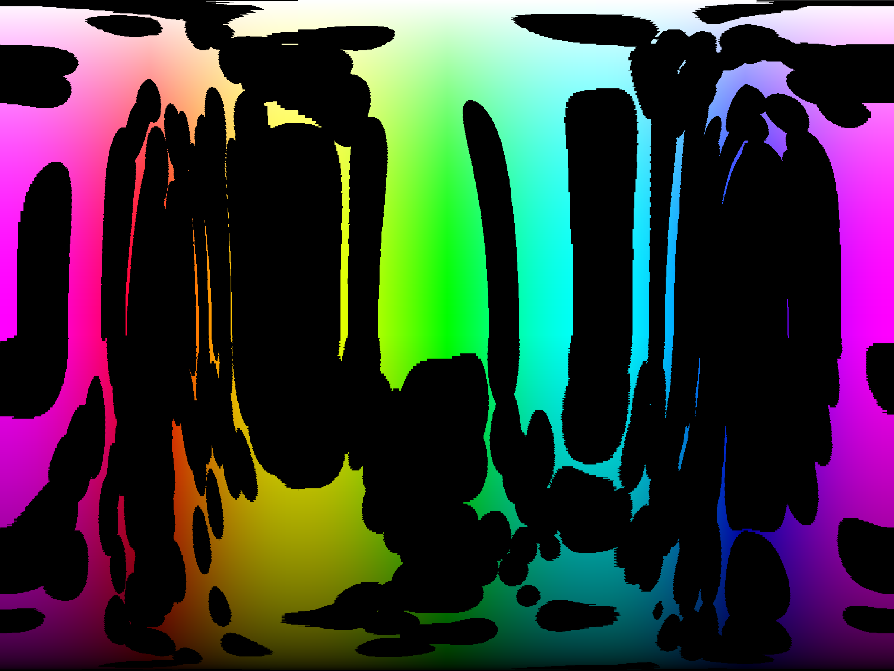

This project was prompted by trying to choose a new colour for linguist to
represent Nim in GitHubs source code breakdown list (at the time of writing it
is a green colour which doesn't really match with the Nim logo). It contains
two scripts. The first takes the `languages.yml` file and generates a list of
colours that are considered far enough from those already in use (based on
CIEDE2000). The second one reads in an image of a spectrum and blacks out any
colour that is not in this list. The result is an image of all the "acceptable"
colours:

NOTE: Since the script to find the valid colours is so slow I've added it to
this repo, this makes this repo pretty big.
